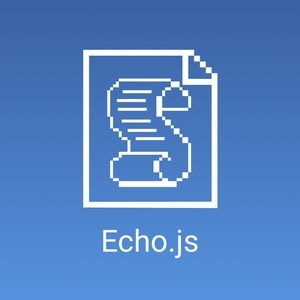

### Hello! This is Astrian.

I am a Monash University student in Master of Information Technology. Now I am in China Mainland. Also, I am a writer, a podcaster and Node.js programmer.

You can follow my [Telegram channel](https://t.me/AstrianFM).

### 

You can consider to tip me on BuyMeACoffee.com.

#### I am writing...

Some text on my personal blog (in Simplify Chinese), with topics about technology, music, culture, or just shattered thoughts. [Here is the link to my blog.](https://astrianzheng.cn)

This blog is powered with [MWeb](https://www.mweb.im/) and I made a website theme for it. The theme called [Reflect White](https://github.com/Astrian/reflect-white-mweb-theme), you can also download and use it (with MWeb app) to generate your static blog or normal website.

#### I am podcasting...

Echo.js is a Mandarin podcast with the topic about programming and technology.

Listen on [podcast website](https://www.echojspodcast.com/), [Apple Podcast](https://podcasts.apple.com/cn/podcast/echo-js/id1516139979), [Pocket Casts](https://pca.st/cvst15fy), [小宇宙](https://www.xiaoyuzhoufm.com/podcast/5ed33dcc418a84a046f579ec) (podcast service based on China Mainland), or any other podcast client with the rss feed address.

#### I am programming...

Some little gadgets. Such as...

- The website theme [Reflect White](https://github.com/Astrian/reflect-white-mweb-theme)
- [The Telegram bot](https://github.com/Astrian/ArkBulletinBot) which fetch Arknight game bulletin and announcements
- [The Node.js package](https://github.com/Astrian/mainetcn) which helps to fetch Maimai DX (an arcade rythem game) data
- [A Termux extension](https://github.com/Astrian/termux-deilveryreader) can remind you to pick up your parcel

----

Feature image: From game *Persona 5* by Atlus.